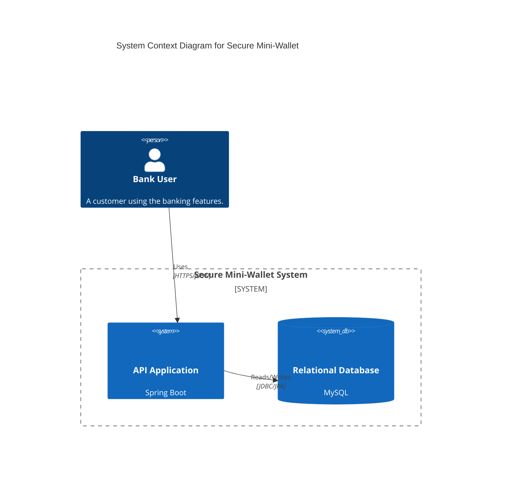
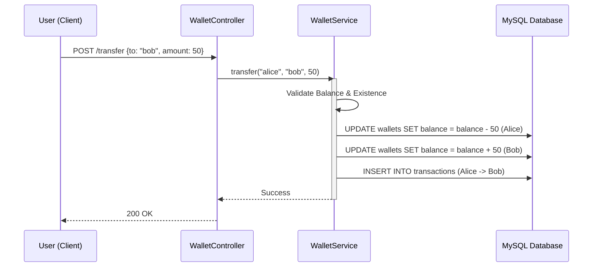

# 🏦 Secure Mini-Wallet


> **A robust, backend-only financial service for secure digital banking operations.** 🚀

---

## 📖 Board of Contents
- [Overview](#-overview)
- [Key Features](#-key-features)
- [Tech Stack](#-tech-stack)
- [Architecture](#-architecture)
- [API Documentation](#-api-documentation)
- [Getting Started](#-getting-started)

---

## 🔍 Overview

**Secure Mini-Wallet** is a production-ready RESTful API designed to handle essential banking operations with a focus on **security**, **atomicity**, and **data integrity**. Built with Spring Boot and MySQL, it simulates a real-world financial systems backend where users can maintain wallets, transfer funds, and audit transactions.

Whether you're building a fintech startup or learning enterprise-grade Java, this project demonstrates how to handle money correctly in code.

---

## ✨ Key Features

*   **🔐 JWT Authentication:** Stateless security using JSON Web Tokens. Secure registration and login flows.
*   **💰 ACID-Compliant Transfers:** Transactional integrity ensures money is never "lost" during transfers, even if the server crashes.
*   **🏦 Automated Wallet Creation:** Users get a zero-balance wallet immediately upon registration.
*   **📜 Audit Logging:** Every deposit and transfer is immutably recorded in a transaction history log.
*   **🛡️ Input Validation:** Prevents negative transfers, self-transfers, and overdrafts.

---

## 🛠 Tech Stack

| Component | Technology | Description |
| :--- | :--- | :--- |
| **Language** | Java 17 | Latest LTS features (Records, Switch expressions) |
| **Framework** | Spring Boot 3 | Rapid API development & Dependency Injection |
| **Database** | MySQL 8 | Relational data persistence for financial records |
| **Security** | Spring Security 6 | Authentication & Authorization chain |
| **ORM** | Spring Data JPA | Hibernate-based data access layer |
| **Tooling** | Maven & Lombok | Dependency management & boilerplate reduction |

---

## 🏗 Architecture

### System Context
The core API sits between the user and the database, acting as the secure gatekeeper.



### Fund Transfer Flow
A visualization of the atomic transfer process.



---

## 🔌 API Documentation

| Method | Endpoint | Description | Auth Required |
| :--- | :--- | :--- | :--- |
| `POST` | `/api/auth/register` | Create a new user & wallet | ❌ |
| `POST` | `/api/auth/login` | Authenticate & get JWT | ❌ |
| `POST` | `/api/wallet/deposit` | Add funds to your wallet | ✅ |
| `POST` | `/api/wallet/transfer` | Send money to another user | ✅ |
| `GET` | `/api/wallet/history` | View your transaction logs | ✅ |

---

## 🚀 Getting Started

### Prerequisites
*   Java 17+
*   Maven 3.8+
*   MySQL Server

### Installation

1.  **Clone the repository**
    ```bash
    git clone https://github.com/yourusername/Secure-Mini-Wallet.git
    cd Secure-Mini-Wallet
    ```

2.  **Configure Database**
    Update `src/main/resources/application.properties` with your MySQL credentials:
    ```properties
    spring.datasource.url=jdbc:mysql://localhost:3306/mini_wallet_db
    spring.datasource.username=root
    spring.datasource.password=yourpassword
    ```

3.  **Build & Run**
    ```bash
    mvn spring-boot:run
    ```

4.  **Test the API**
    Import the collection into Postman or use curl to hit `http://localhost:8080/api/auth/register`.

---

<div align="center">
  <sub>Built with ❤️ by Java Developers. Star this repo if you found it useful! ⭐️</sub>
</div>
